# Student Survey Service - Backend Implementation

## TEAM MEMBERS 

Lydia Prince Edwin Sheeba - G01507041  
Miruthula Jawahar - G01524859  
Mohana Priyanka Romala - G01506960  
Ruchita Darur - G01514822  

## URL 
http://54.162.212.78:8080/survey.html

## Overview
This repository contains the backend implementation for the Student Survey Management System. It provides RESTful API endpoints to manage student survey data using Spring Boot, JPA/Hibernate, and MySQL database.

## Team Member 1 Contribution
As Team Member 1, I was responsible for implementing the backend REST API for the student survey application with the following components:

- Spring Boot application structure setup
- JPA/Hibernate entity models
- Repository layer for database operations
- Service layer business logic
- RESTful API controllers
- Exception handling
- Data validation

## Technology Stack
- Java 17
- Spring Boot 3.4.4
- Spring Data JPA
- Hibernate
- MySQL
- Maven

## Spring Initializer 
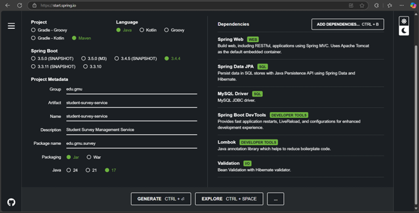

## Project Structure

student-survey-service/  
├── src/main/java/edu/gmu/survey/  
│   ├── controller/  
│   │   └── SurveyResponseController.java  
│   ├── model/  
│   │   └── SurveyResponse.java  
│   ├── repository/  
│   │   └── SurveyResponseRepository.java  
│   ├── service/  
│   │   ├── SurveyResponseService.java  
│   │   └── SurveyResponseServiceImpl.java  
│   ├── dto/  
│   │   └── SurveyResponseDTO.java  
│   ├── exception/  
│   │   └── ApiExceptionHandler.java  
│   └── StudentSurveyServiceApplication.java  
└── src/main/resources/  
└── application.properties  

## Entity Model
The `SurveyResponse` entity includes the following fields:
- First name, last name (required)
- Street address, city, state, zip (required)
- Telephone number, email (required)
- Date of survey (required)
- Campus likes (multiple options: students, location, campus, atmosphere, dorm rooms, sports)
- Interest source (options: friends, television, Internet, other)
- Recommendation likelihood (options: Very Likely, Likely, Unlikely)

## API Endpoints

| Method | URL | Description |
|--------|-----|-------------|
| GET | /api/surveys | Get all surveys |
| GET | /api/surveys/{id} | Get survey by ID |
| POST | /api/surveys | Create a new survey |
| PUT | /api/surveys/{id} | Update an existing survey |
| DELETE | /api/surveys/{id} | Delete a survey |

## How to Run Locally

1. Clone the repository
2. Configure application.properties with your database settings
3. Run the application:
mvn spring-boot
4. The API will be available at http://localhost:8080/api/surveys

## Building the JAR file

To build the executable JAR file:
mvn clean package

The JAR will be created in the target directory as `student-survey-service-0.0.1-SNAPSHOT.jar`

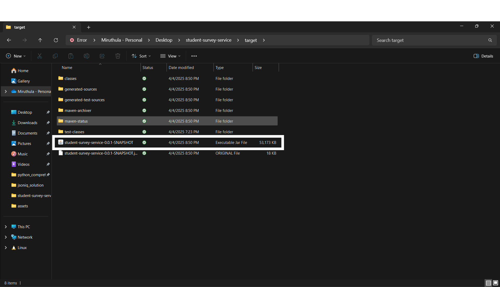

## Testing with Postman

### Create a New Survey (POST)
- URL: http://localhost:8080/api/surveys
- Method: POST
- Headers: Content-Type: application/json
- Body:
```json
{
  "firstName": "John",
  "lastName": "Doe",
  "streetAddress": "739 Main St",
  "city": "Fairfax",
  "state": "VA",
  "zip": "22030",
  "telephoneNumber": "5717373758",
  "email": "john@example.com",
  "dateOfSurvey": "2025-06-02",
  "campusLikes": ["campus"],
  "interestSource": ["internet"],
  "recommendationLikelihood": ["Very Likely"]
}  
``` 
## Post
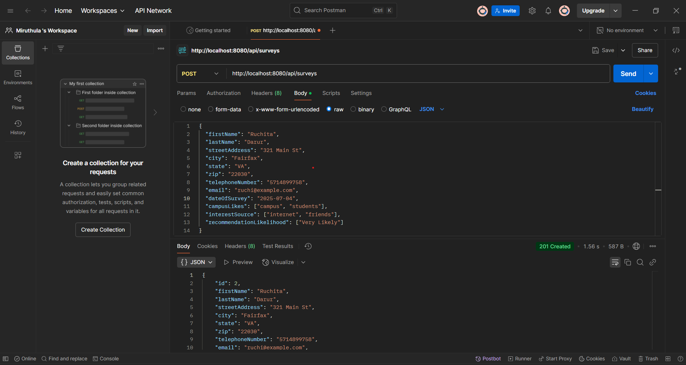

## Get
Get All Surveys (GET)

URL: http://localhost:8080/api/surveys  
Method: GET

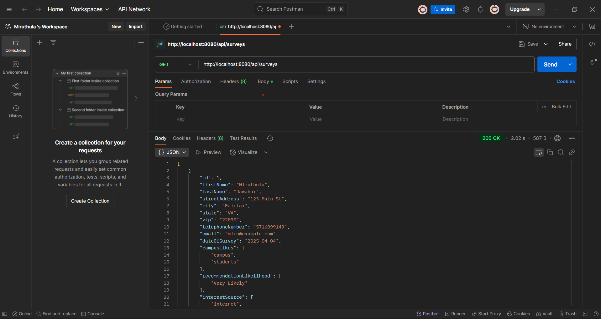

## GetById
Get Survey by ID (GET)

URL: http://localhost:8080/api/surveys/{id}  
Method: GET

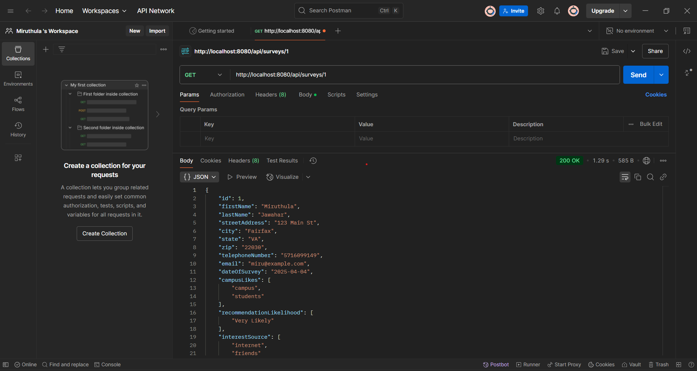

## Put
Update Survey (PUT)

URL: http://localhost:8080/api/surveys/{id}  
Method: PUT    
Headers: Content-Type: application/json  
Body: Same format as POST

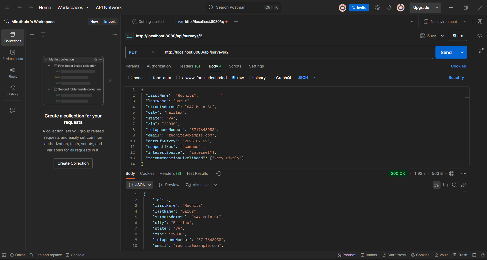

## Delete
Delete Survey (DELETE)

URL: http://localhost:8080/api/surveys/{id}  
Method: DELETE  

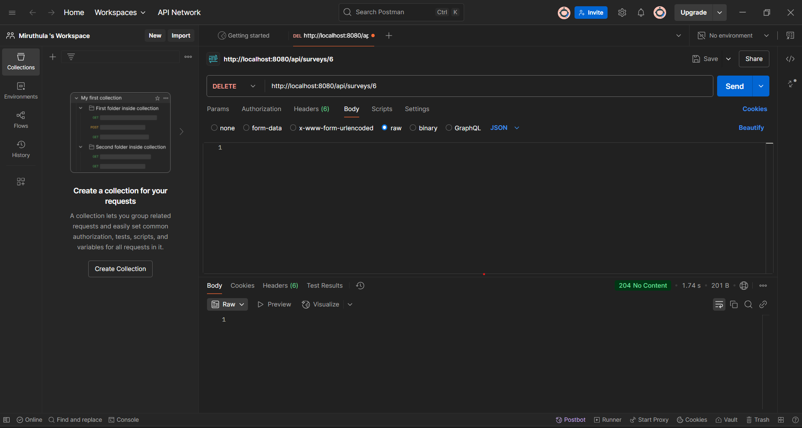  

## Team Member -2 - Contribution - Database Setup 
This document outlines the steps taken to set up the database infrastructure for our student survey microservice application.

## Database Infrastructure

* Platform: Amazon RDS MySQL
* Instance Name: database-1
* Instance Type: db.t4g.micro
* Storage: 20GB General Purpose SSD
* Endpoint: database-1.cpmwkabzwidn.us-east-1.rds amazonaws.com
* Port: 3306
* Database Name: student_survey_db

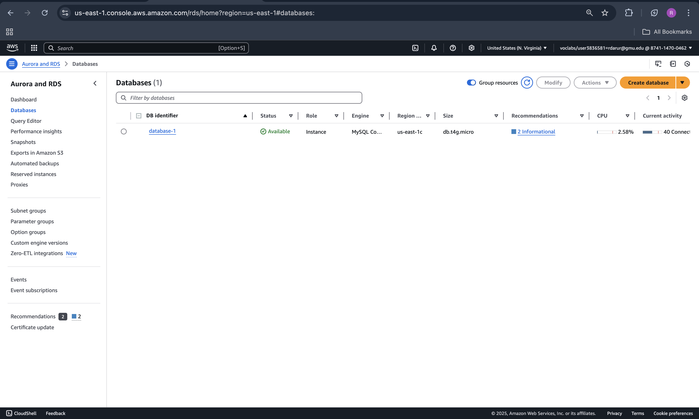  

## Security Configuration

* Security group configured to allow MySQL connections on port 3306.
* Public accessibility enabled for application connections.

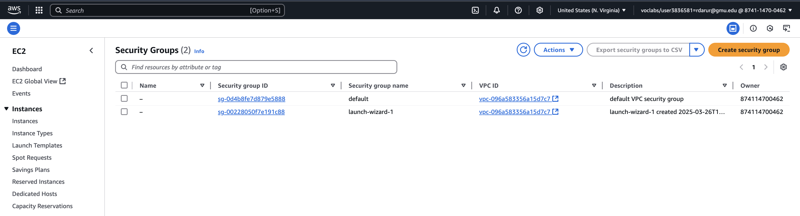 

## Database Schema
The application uses Hibernate ORM to automatically generate the database schema. The main table created is:

```
survey_responses ( <br>
  id BIGINT AUTO_INCREMENT PRIMARY KEY, <br>
  city VARCHAR(255), <br>
  date_of_survey DATE NOT NULL, <br>
  email VARCHAR(255), <br>
  first_name VARCHAR(255), <br>
  interest_source VARCHAR(255), <br>
  last_name VARCHAR(255), <br>
  recommendation_likelihood VARCHAR(255), <br> 
  state VARCHAR(255), <br>
  street_address VARCHAR(255), <br>
  telephone_number VARCHAR(255), <br>
  zip VARCHAR(255) <br>
) <br>
```

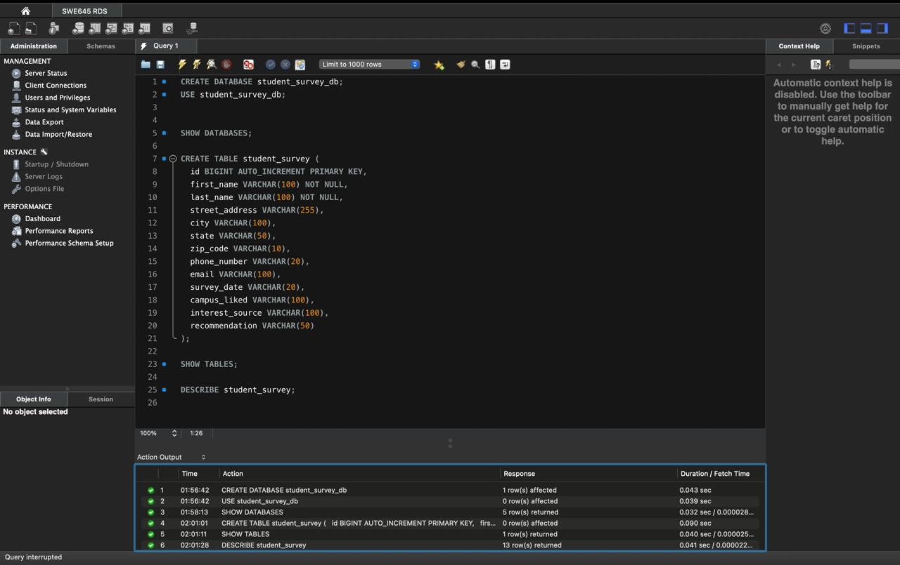 

## Connection Configuration
The database connection is configured in the Spring Boot application's application.properties file:

spring.datasource.url=jdbc:mysql://database-1.cpmwkabzwidn.us-east-1.rds.amazonaws.com:3306/student_survey_db?createDatabaseIfNotExist=true <br>
spring.datasource.username=admin <br>
spring.datasource.password=adminswe645 <br>
spring.datasource.driver-class-name=com.mysql.cj.jdbc.Driver <br>

## Deployment Notes

The database is deployed in AWS RDS and is ready for connection from any environment
Hibernate is configured to update the schema automatically when the application starts
Data persistence is fully functional, with test data successfully stored and retrieved.

## Team Member -3 - Contribution - CONTAINERIZATION USING DOCKER
 ---
In this part we containerized the Spring Boot backend application using Docker.
---
### TECHNOLOGIES USED ARE:
   - JAVA 17
   - Spring Boot
   - Docker
   - Maven
   - Dockerhub

From the folder student-survey-service, we creaded a file Dockerfile and it consists of the following code
```
FROM openjdk:17-jdk-slim
WORKDIR /app
COPY target/*.jar app.jar
EXPOSE 8080
ENTRYPOINT ["java", "-jar", "app.jar"]
```
Then we built jar file using 
```
mvn clean package
```
This command creates jar file 
```
student-survey-service-0.0.1-SNAPSHOT.jar
```
Then we built a docker image using 
```
student-survey-service-0.0.1-SNAPSHOT.jar
```
This builds a docker image using the dockerfile and jar file we built

Then we ran our image locally using port 8080 using command
```
docker run -p 8080:8080 student-survey-app
```
Then checked whether this works or not locally using the link
```
http://localhost:8080/survey.html
```
### NOTE: THE ABOVE LINK IS ONLY TO OPEN IN LAPTOP LOCALLY WHERE THE IMAGE IS RUNNING

### The output is
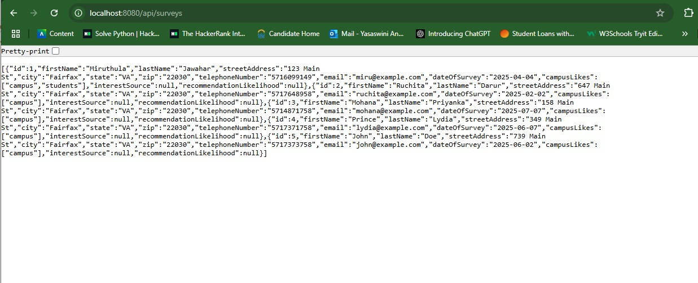

Then we tagged the image using the command:
```
docker tag student-survey-app mohana171/student-survey-app
```
Then we pushed the image to Docker Hub using:
```
docker push mohana171/student-survey-app
```
The docker hub link is 
```
https://hub.docker.com/r/mohana171/student-survey-app
```
Finally shared Docker Hub user id to member 4

## Team Member - 4 - Contribution 

## Student Survey App - Docker & Kubernetes Deployment

## 👤 Contributor Role

As part of the SWE 645 Assignment 3 team, my responsibility focused on Dockerizing the backend application and verifying its deployment using Kubernetes and Rancher. This included image management, service exposure, and validating frontend + API accessibility.

---

## Docker Image Information

- **Image Name**: `mohana171/student-survey-app`
- **Hosted on Docker Hub**: https://hub.docker.com/r/mohana171/student-survey-app
- **Exposed Container Port**: `8080`

---

## Docker Commands Executed on EC2

```bash
# Start Docker if not running
sudo systemctl start docker

# Pull image from Docker Hub
docker pull mohana171/student-survey-app:latest

# (Optional) Build image if Dockerfile is available
# docker build -t mohana171/student-survey-app:latest .

# (Optional) Push to Docker Hub if image was built
# docker login
# docker push mohana171/student-survey-app:latest
```

---

## Kubernetes Deployment via Rancher

### Access Rancher Dashboard
1. Open browser and go to: `http://<EC2-Public-IP>:80`
2. Login to Rancher

### Create Workload (Deployment)
- Namespace: `default`
- Deployment Name: `student-survey-deployment`
- Image: `mohana171/student-survey-app:latest`
- Container Port: `8080`
- Number of Pods: `2`

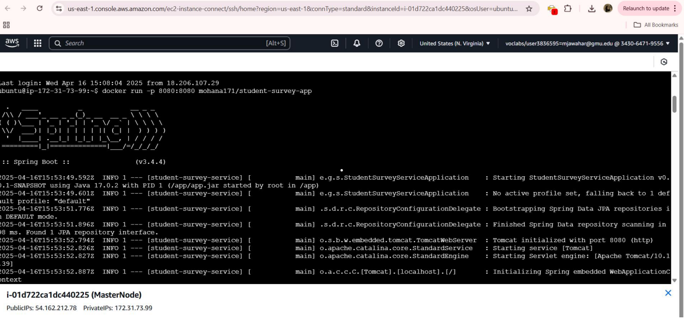

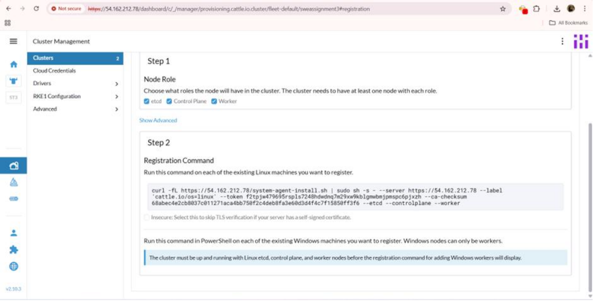

### Create Service
- Go to **Service Discovery > Services > Create**
- Name: `student-survey-service`
- Target: `student-survey-app`
- Type: `NodePort`
- Port: `8080`
- NodePort: `30007`

---

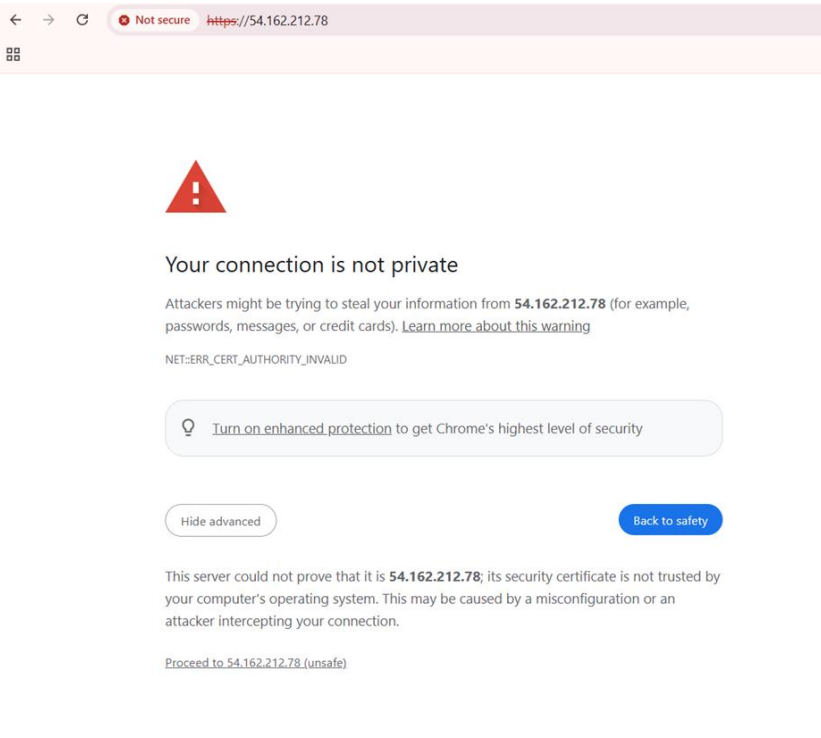

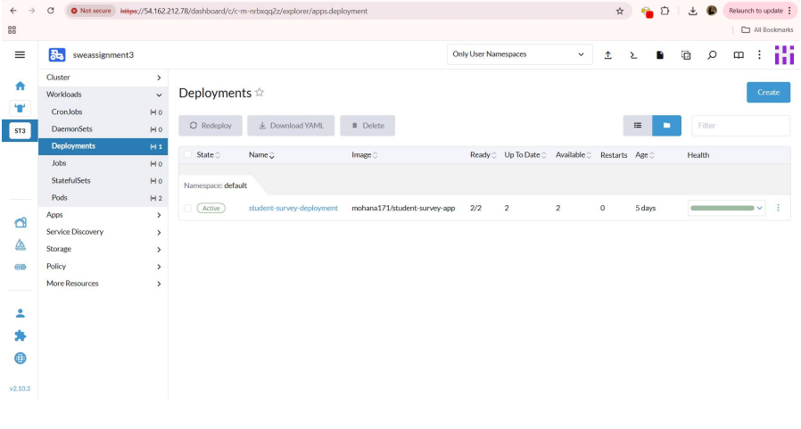

## EC2 Inbound Rules (AWS Security Group)
Ensure the following rules are open:

| Port    | Protocol | Source      |
|---------|----------|-------------|
| 22      | TCP      | 0.0.0.0/0   |
| 80      | TCP      | 0.0.0.0/0   |
| 443     | TCP      | 0.0.0.0/0   |
| 8080    | TCP      | 0.0.0.0/0   |
| 30007   | TCP      | 0.0.0.0/0   |

---
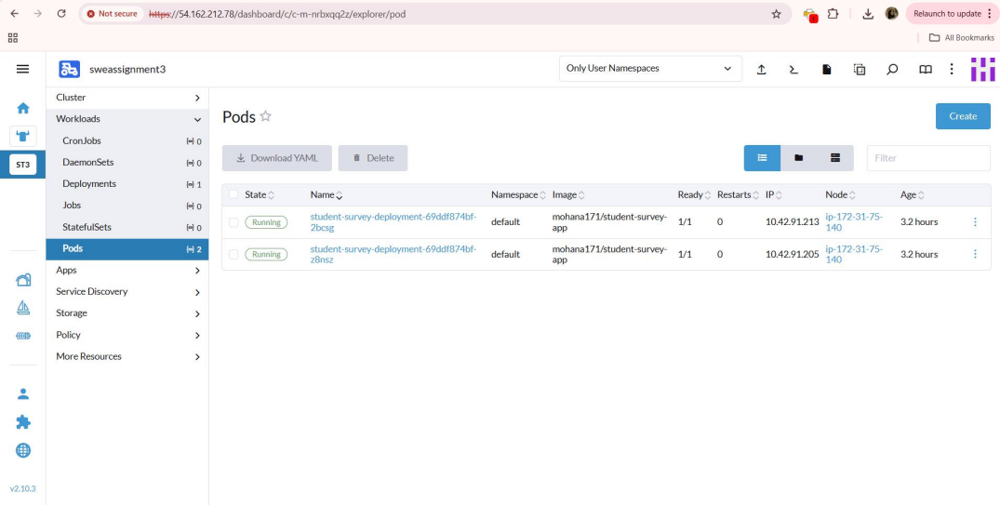

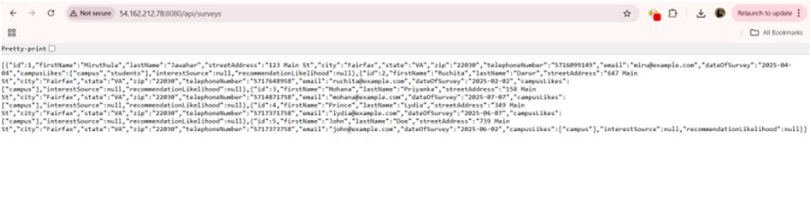

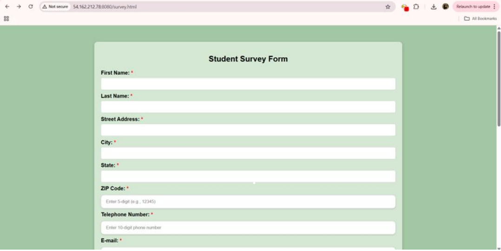

## API & Frontend Access

Once deployment is active and NodePort is exposed, you can access:

```bash
# Check backend API response
http://<EC2-Public-IP>:8080/api/surveys

# Open frontend survey form
http://<EC2-Public-IP>:8080/survey.html
```

---

## Known Issue

Submitting the form currently throws:

```json
{"error": "An unexpected error occurred: Request method 'POST' is not supported"}
```

This indicates the backend may not have a `@PostMapping` method matching the form submission. Flagged for team resolution.

---

## Files Included

- `Dockerfile`
- `deployment.yaml` (exported from Rancher)
- `service.yaml` (exported from Rancher)
- `README.md` (this file)

---

## Summary

This covers the complete containerization, deployment, service exposure, and verification of both backend API and frontend static HTML integration using Docker, Rancher, and EC2.

